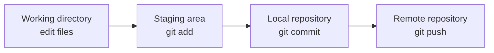
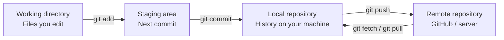
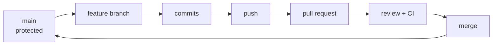
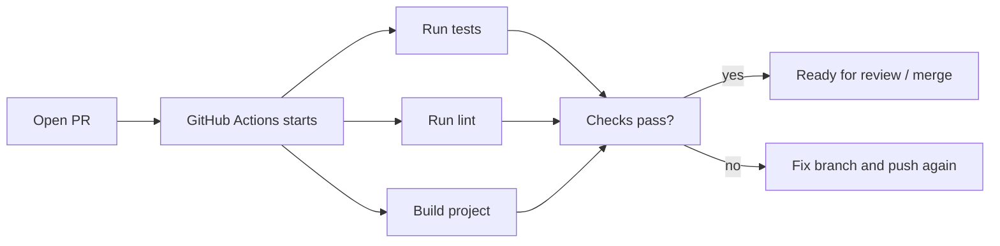
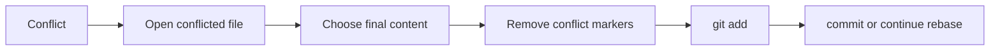
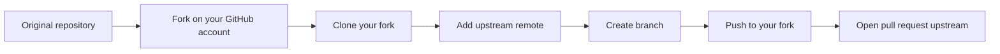
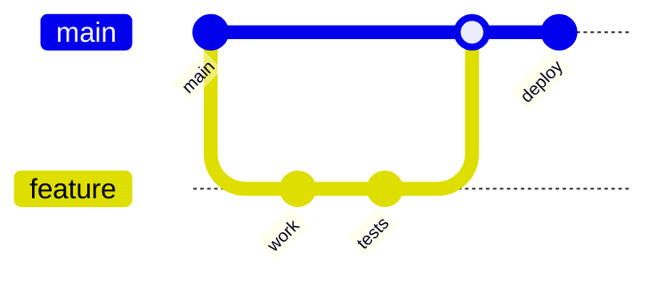
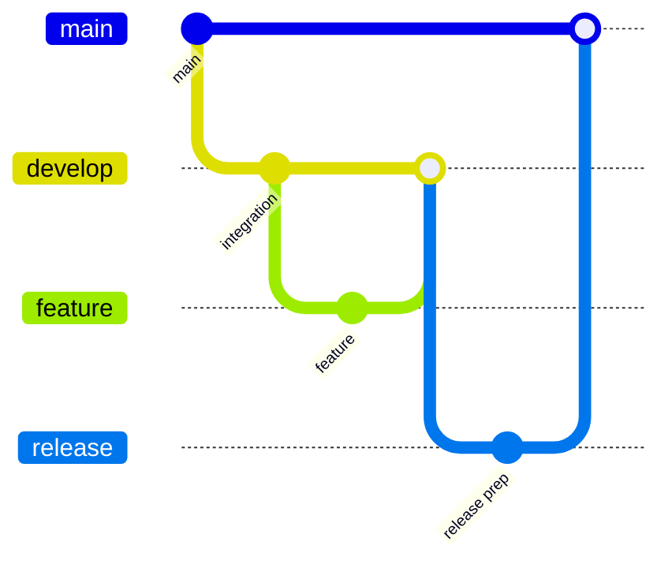
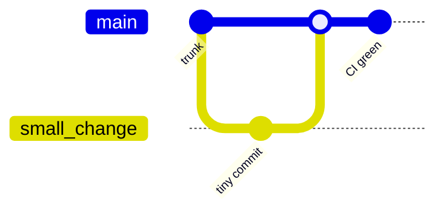

# Git & GitHub Handbook

[](https://git-scm.com/)
[](https://github.com/)
[](#quick-start)
[](#open-source-contribution-workflow)
[](#cheat-sheets)

> A practical guide to using Git and GitHub in real projects.
> Learn the concepts, commands, workflows, and recovery techniques developers use every day.

**Target audience:** This guide is for people who are new to Git but want to understand real-world team workflows. It also works as a reference for junior developers, open-source contributors, and experienced users who want safer habits and sharper troubleshooting.

**Last updated:** 2026-05-26

---

## Quick Start

If you only need the daily workflow, start here. The deeper explanations come after this section.

```bash
git status
git pull
git switch -c feature/name
git add .
git commit -m "Add feature"
git push -u origin feature/name
```

Then open a pull request on GitHub.

> [!IMPORTANT]
> A commit is local until you push it. GitHub cannot see your work, and you usually cannot open a pull request, until your branch exists on GitHub.

### 60-Second Mental Model

| Step | Purpose | Command |
|---|---|---|
| Check state | See your branch and changed files | `git status` |
| Review changes | Inspect the actual line-by-line edits | `git diff` |
| Stage changes | Choose what belongs in the next commit | `git add` |
| Save changes | Create a local snapshot | `git commit` |
| Upload branch | Send commits to GitHub | `git push` |
| Open review | Discuss and approve changes | Pull Request |



> [!TIP]
> The diagram above is the core Git loop. Most commands either inspect one of these areas or move changes from one area to the next.

### Remember This First

These commands solve most day-to-day situations:

| Command | Why It Matters |
|---|---|
| `git status` | Shows what Git sees right now |
| `git diff` | Shows exactly what changed |
| `git add` | Stages changes for the next commit |
| `git commit` | Saves staged changes locally |
| `git push` | Uploads commits to a remote |
| `git pull` | Downloads and integrates remote changes |
| `git switch -c` | Creates and switches to a new branch |
| `git restore` | Restores working-tree or staged changes |
| `git revert` | Safely undoes a committed change with a new commit |
| `git log --oneline` | Shows commit history compactly |

### Key Terms Before You Continue

| Term | Short Meaning |
|---|---|
| Commit | A saved snapshot of project changes |
| Branch | A separate line of work |
| Remote | Another copy of the repository, usually on GitHub |
| `origin` | The default name for the remote you cloned from |
| `upstream` | Often the original repository when you work from a fork |
| `HEAD` | Pointer to the branch or commit you are currently looking at |
| Staging area | Changes prepared for the next commit |
| Merge | Combine branch histories |
| Rebase | Replay commits on top of another base commit |
| Pull request | GitHub review process for proposed changes |
| Clone | Download a repository and its history |
| Fork | Your GitHub copy of someone else's repository |
| Tag | A named pointer to a specific commit, often a release |
| Stash | Temporary storage for unfinished work |
| Reflog | Local safety log that helps recover lost commits |

See the full [Glossary](#glossary) for more detail.

---

## Table Of Contents

- [Quick Start](#quick-start)
- [Why This Guide Exists](#why-this-guide-exists)
- [Git And GitHub In Plain English](#git-and-github-in-plain-english)
- [Core Concepts](#core-concepts)
- [Decision Tables](#decision-tables)
- [Installation Guide](#installation-guide)
- [First-Time Git Configuration](#first-time-git-configuration)
- [SSH Setup For GitHub](#ssh-setup-for-github)
- [Create Your First Repository](#create-your-first-repository)
- [Clone An Existing Repository](#clone-an-existing-repository)
- [The Everyday Commit Workflow](#the-everyday-commit-workflow)
- [Branches Explained](#branches-explained)
- [Stashing Unfinished Work](#stashing-unfinished-work)
- [Working With Remote Repositories](#working-with-remote-repositories)
- [GitHub CLI](#github-cli)
- [Pull Requests](#pull-requests)
- [GitHub Team Workflows](#github-team-workflows)
- [Merging, Squashing, And Rebasing](#merging-squashing-and-rebasing)
- [Undoing Changes Safely](#undoing-changes-safely)
- [Resolving Merge Conflicts](#resolving-merge-conflicts)
- [GitHub Issues](#github-issues)
- [Forking Repositories](#forking-repositories)
- [Open Source Contribution Workflow](#open-source-contribution-workflow)
- [Tags, Releases, And Semantic Versioning](#tags-releases-and-semantic-versioning)
- [Professional Workflow Examples](#professional-workflow-examples)
- [Practical Mini Project](#practical-mini-project)
- [Best Practices](#best-practices)
- [Security](#security)
- [Common Mistakes](#common-mistakes)
- [Troubleshooting](#troubleshooting)
- [How To Read Common Git Errors](#how-to-read-common-git-errors)
- [Cheat Sheets](#cheat-sheets)
- [Advanced Tips For Power Users](#advanced-tips-for-power-users)
- [FAQ](#faq)
- [Glossary](#glossary)
- [Further Reading](#further-reading)
- [What To Do Next](#what-to-do-next)
- [Final One-Page Cheat Sheet](#final-one-page-cheat-sheet)

---

## Why This Guide Exists

Git is one of the most important tools in modern software development, but it can feel confusing at first because it mixes several ideas at once: saving work, comparing versions, collaborating with others, reviewing code, publishing releases, and recovering from mistakes.

This guide is designed to be a practical handbook you can return to whenever you need to:

- Save your work safely.
- Understand what Git is doing.
- Collaborate with teammates on GitHub.
- Fix common mistakes without panic.
- Contribute to open source projects professionally.
- Build reliable habits used by experienced developers.

> [!TIP]
> If you are lost, start with `git status`. It is the safest and most useful Git command because it tells you what branch you are on, what changed, and what Git expects next.

---

## Git And GitHub In Plain English

### What Is Git?

Git is a distributed version control system. In simple terms, Git tracks changes to files over time so you can:

- Save meaningful versions of a project.
- Compare what changed between versions.
- Return to earlier versions when needed.
- Work on multiple ideas at the same time using branches.
- Collaborate without constantly overwriting each other.

Git runs on your computer. You can use Git without GitHub.

### What Is GitHub?

GitHub is a cloud platform built around Git repositories. It adds collaboration features such as:

- Remote repository hosting.
- Pull requests.
- Code review.
- Issues and project planning.
- Actions for automation and CI/CD.
- Releases.
- Wikis and documentation.
- Open source discovery.

Git is the version control tool. GitHub is a collaboration platform that hosts Git repositories.

### Why Developers Use Them

| Need | How Git Helps | How GitHub Helps |
|---|---|---|
| Save work | Commits store snapshots | Remote backups store commits online |
| Work safely | Branches isolate changes | Pull requests review changes before merge |
| Collaborate | Merges combine work | Reviews, comments, checks, and permissions |
| Fix mistakes | Revert, restore, reset, reflog | PR history and protected branches |
| Release software | Tags mark versions | Releases publish changelogs and assets |
| Track tasks | Commit messages reference context | Issues organize bugs, ideas, and work |

> [!NOTE]
> GitHub is not the only Git hosting service. GitLab, Bitbucket, Azure DevOps, and self-hosted Git servers use the same Git foundations.

---

## Core Concepts

Before memorizing commands, learn the pieces Git works with.

### Repository

A repository, often called a repo, is a project folder tracked by Git. It contains your files plus a hidden `.git` directory where Git stores history.

```bash
git init
```

### Commit

A commit is a saved snapshot of your project at a specific moment.

Each commit has:

- A unique hash, such as `a1b2c3d`.
- An author.
- A timestamp.
- A commit message.
- A reference to the previous commit.

### Working Directory, Staging Area, Local Repository, And Remote Repository

Git becomes much easier when you understand the four places your work can live:

| Area | Plain-English Meaning | Typical Command |
|---|---|---|
| Working directory | Files currently being edited on your machine | `git status`, `git diff` |
| Staging area | Changes prepared for the next commit | `git add`, `git restore --staged` |
| Local repository | Saved commit history on your machine | `git commit`, `git log` |
| Remote repository | Copy hosted on GitHub or another server | `git push`, `git fetch`, `git pull` |

```text
Working directory  ->  Staging area  ->  Local repository  ->  Remote repository
 edit files             git add            git commit             git push
```



> [!TIP]
> Think of staging as packing a box. You can decide exactly which changes go into the next commit before sealing the box with `git commit`.

### Local History Vs Remote History

Git history exists locally before it exists on GitHub.

| Idea | Meaning |
|---|---|
| Local commit | Saved on your machine only |
| Pushed commit | Uploaded to a remote such as GitHub |
| `git fetch` | Downloads remote history without changing your working files |
| `git pull` | Downloads remote history and integrates it into your current branch |
| Pull request | Can usually be opened only after your branch has been pushed |

> [!IMPORTANT]
> Your laptop and GitHub can disagree for a while. That is normal. `git push` uploads your local commits. `git fetch` downloads remote information. `git pull` downloads and integrates remote information.

### Branch

A branch is a movable pointer to a line of work. Branches let you build a feature, fix a bug, or experiment without changing the main version immediately.

```bash
git switch -c feature/login-form
```

### Remote

A remote is a named connection to another copy of the repository, usually on GitHub.

```bash
git remote -v
```

The default remote is usually called `origin`.

### HEAD

`HEAD` points to the branch or commit you are currently looking at. A simple analogy: `HEAD` is like the playback needle pointing to the commit currently being played.

Usually `HEAD` points to a branch:

```text
main -> commit C
HEAD -> main
```

In a detached HEAD state, `HEAD` points directly to a commit instead of a branch:

```text
commit A -> commit B -> commit C
              ^
             HEAD
```

Detached HEAD is useful for inspecting old history, but if you make new work there, save it on a branch:

```bash
git switch -c recovery/my-work
```

### Pull Request

A pull request, often called a PR, is a GitHub discussion around proposed changes. It lets people review code before those changes are merged.

> [!NOTE]
> Pull requests are a GitHub feature, not a core Git command. Git handles commits and branches; GitHub adds review, comments, checks, and merge buttons.

---

## Decision Tables

Use these tables when you know what you want but are unsure which Git tool fits the situation.

### Should I Use Merge, Rebase, Or Squash?

| Use This | When | What It Does | Watch Out For |
|---|---|---|---|
| Merge | You want to preserve branch history | Combines branches with a merge commit when needed | History can look busier |
| Rebase | You want a linear local feature branch | Replays your commits on top of another branch | Rewrites commits; avoid on shared branches unless expected |
| Squash | A branch has many noisy commits | Combines many commits into one clean commit | Loses individual commit detail |

> [!IMPORTANT]
> Avoid rebasing shared branches unless your team explicitly expects it. Rebase is best for local or personal feature branches.

### Should I Use Reset, Restore, Or Revert?

| Use This | Best For | Changes Files? | Changes Local History? | Changes Remote History? |
|---|---|---:|---:|---:|
| `git restore` | Working-tree or staging-area changes | Yes | No | No |
| `git reset --soft` | Undoing local unpushed commits while keeping changes staged | No | Yes | No |
| `git reset --hard` | Discarding local commits and file changes | Yes | Yes | No, unless pushed later |
| `git revert` | Undoing commits that were already pushed | Yes | Adds new commit | No rewrite |

> [!CAUTION]
> `git reset --hard` can delete local work. Use `git revert` for pushed commits and `git restore` for ordinary file or staging changes.

### Should I Use HTTPS Or SSH?

| Option | Good For | Pros | Cons |
|---|---|---|---|
| HTTPS | Beginners, locked-down networks, quick cloning | Works almost everywhere, simple URLs, integrates with credential managers | May require token or credential-manager setup for pushing |
| SSH | Frequent contributors and daily development | Convenient after setup, no token prompt for each push, strong key-based auth | Initial key setup can be confusing; some networks block SSH |

Both HTTPS and SSH are valid. HTTPS is not obsolete. SSH is often more comfortable once you contribute regularly.

### Should I Create A Branch, Fork, Or Clone?

| Action | Use When | Example |
|---|---|---|
| Clone | You need a local copy of a repository | `git clone URL` |
| Branch | You have write access and want isolated work | `git switch -c feature/name` |
| Fork | You do not have write access or want your own GitHub copy | Fork on GitHub, then clone your fork |

### Should I Use `git branch -d` Or `git branch -D`?

| Command | Behavior | Recommendation |
|---|---|---|
| `git branch -d branch-name` | Deletes only if Git believes the branch was merged | Use by default |
| `git branch -D branch-name` | Force-deletes even with unmerged work | Use only when you are sure |

---

## Installation Guide

Install Git once on your machine, then verify it from the terminal.

### Check Whether Git Is Already Installed

```bash
git --version
```

If Git is installed, you will see something like:

```text
git version 2.45.0
```

<details>
<summary><strong>Windows installation</strong></summary>

Recommended options:

| Method | Command Or Link | Notes |
|---|---|---|
| Official installer | [git-scm.com/download/win][git-download-windows] | Best default for most users |
| Windows Package Manager | `winget install --id Git.Git -e --source winget` | Convenient for terminal users |
| Chocolatey | `choco install git` | Good if you already use Chocolatey |

After installation, open a new terminal and run:

```powershell
git --version
```

> [!TIP]
> On Windows, Git for Windows includes Git Bash and Git Credential Manager. Git Bash gives you a Unix-like shell, while Credential Manager helps GitHub authentication work smoothly.

</details>

<details>
<summary><strong>macOS installation</strong></summary>

Recommended options:

| Method | Command Or Link | Notes |
|---|---|---|
| Xcode Command Line Tools | `xcode-select --install` | Simple and common |
| Homebrew | `brew install git` | Great for developers using Homebrew |
| Official installer | [git-scm.com/download/mac][git-download-mac] | Manual installer |

Verify:

```bash
git --version
```

</details>

<details>
<summary><strong>Linux installation</strong></summary>

Use your distribution package manager.

```bash
# Debian / Ubuntu
sudo apt update
sudo apt install git

# Fedora
sudo dnf install git

# Arch Linux
sudo pacman -S git
```

Verify:

```bash
git --version
```

</details>

> [!IMPORTANT]
> After installing Git, configure your name and email before making commits. This information becomes part of your commit history.

---

## First-Time Git Configuration

Git stores configuration at several levels:

| Level | Scope | Example |
|---|---|---|
| System | All users on the computer | Rarely needed |
| Global | Your user account | Most common |
| Local | One repository | Project-specific settings |

### Set Your Name And Email

Use the same email address that is connected to your GitHub account.

```bash
git config --global user.name "Your Name"
git config --global user.email "you@example.com"
```

Check your configuration:

```bash
git config --global --list
```

### Set The Default Branch Name

Most modern projects use `main` as the default branch.

```bash
git config --global init.defaultBranch main
```

### Choose A Default Editor

Examples:

```bash
# Visual Studio Code
git config --global core.editor "code --wait"

# Vim
git config --global core.editor "vim"

# Nano
git config --global core.editor "nano"
```

### Recommended Quality-Of-Life Settings

```bash
# Show colors in Git output
git config --global color.ui auto

# Reuse recorded conflict resolutions when possible
git config --global rerere.enabled true

# Make pulls safer by requiring an explicit strategy when histories diverge
git config --global pull.ff only
```

> [!WARNING]
> `pull.ff only` is a clean, strict default, but it means `git pull` may stop if your branch and the remote branch both have new commits. When that happens, choose whether to merge or rebase intentionally.

### Line Ending Settings

Line endings can differ between Windows and Unix-like systems.

```bash
# Windows
git config --global core.autocrlf true

# macOS / Linux
git config --global core.autocrlf input
```

> [!TIP]
> Teams can avoid line-ending noise by adding a `.gitattributes` file to the repository.

Example:

```gitattributes
* text=auto
*.sh text eol=lf
*.bat text eol=crlf
```

---

## SSH Setup For GitHub

GitHub supports HTTPS and SSH. HTTPS is simple. SSH is convenient for frequent contributors because you can authenticate with a key instead of typing credentials.

### SSH Setup Overview

| Step | Purpose |
|---|---|
| Generate an SSH key | Creates a private/public key pair |
| Add key to SSH agent | Makes the key available to Git |
| Add public key to GitHub | Allows GitHub to recognize your machine |
| Test connection | Confirms everything works |

> [!CAUTION]
> Never share your private key. Your private key usually lives in `~/.ssh/id_ed25519`. The public key ends with `.pub` and is safe to add to GitHub.

### Check For Existing SSH Keys

```bash
ls ~/.ssh
```

Look for files such as:

```text
id_ed25519
id_ed25519.pub
```

### Generate A New SSH Key

```bash
ssh-keygen -t ed25519 -C "you@example.com"
```

Press `Enter` to accept the default file location. Use a passphrase if you want stronger local protection.

### Start The SSH Agent And Add Your Key

<details>
<summary><strong>macOS or Linux</strong></summary>

```bash
eval "$(ssh-agent -s)"
ssh-add ~/.ssh/id_ed25519
```

</details>

<details>
<summary><strong>Windows PowerShell</strong></summary>

```powershell
Get-Service ssh-agent | Set-Service -StartupType Automatic
Start-Service ssh-agent
ssh-add $env:USERPROFILE\.ssh\id_ed25519
```

</details>

### Copy The Public Key

<details>
<summary><strong>macOS clipboard</strong></summary>

```bash
pbcopy < ~/.ssh/id_ed25519.pub
```

</details>

<details>
<summary><strong>Windows PowerShell clipboard</strong></summary>

```powershell
Get-Content $env:USERPROFILE\.ssh\id_ed25519.pub | Set-Clipboard
```

</details>

<details>
<summary><strong>Linux clipboard</strong></summary>

```bash
xclip -selection clipboard < ~/.ssh/id_ed25519.pub
```

If `xclip` is not installed, print the key and copy it manually:

```bash
cat ~/.ssh/id_ed25519.pub
```

</details>

### Add The Key To GitHub

1. Open GitHub.
2. Go to **Settings**.
3. Open **SSH and GPG keys**.
4. Click **New SSH key**.
5. Paste your public key.
6. Save.

### Test The Connection

```bash
ssh -T git@github.com
```

Expected result:

```text
Hi username! You've successfully authenticated, but GitHub does not provide shell access.
```

> [!NOTE]
> That message is good news. It means authentication worked. GitHub is only saying SSH is for Git operations, not for opening a remote shell.

---

## Create Your First Repository

You can create a repository on GitHub first, or create a local project first and connect it later.

### Option A: Create A Repository On GitHub

1. Click **New repository** on GitHub.
2. Choose an owner and repository name.
3. Add a short description.
4. Choose public or private visibility.
5. Optionally add:
   - `README.md`
   - `.gitignore`
   - License
6. Click **Create repository**.

> [!TIP]
> Add a `.gitignore` when creating a project with generated files, dependencies, build outputs, or secrets. It keeps your repository clean from the beginning.

### Option B: Create A Local Repository

```bash
mkdir my-project
cd my-project
git init
```

Create a README:

```bash
echo "# My Project" > README.md
```

Make your first commit:

```bash
git add README.md
git commit -m "Add project README"
```

Connect to GitHub:

```bash
git remote add origin git@github.com:your-username/my-project.git
git push -u origin main
```

### Recommended Starter Files

| File | Why It Matters |
|---|---|
| `README.md` | Explains what the project is and how to use it |
| `.gitignore` | Prevents unwanted files from being committed |
| `LICENSE` | Defines how others can use the project |
| `CONTRIBUTING.md` | Explains how to contribute |
| `CODE_OF_CONDUCT.md` | Sets community expectations |
| `.github/PULL_REQUEST_TEMPLATE.md` | Helps contributors open better PRs |
| `.github/ISSUE_TEMPLATE/` | Makes bug reports and feature requests clearer |

---

## Clone An Existing Repository

Cloning downloads a full copy of a repository, including its commit history.

### Clone With SSH

```bash
git clone git@github.com:octocat/Hello-World.git
cd Hello-World
```

### Clone With HTTPS

```bash
git clone https://github.com/octocat/Hello-World.git
cd Hello-World
```

### Clone Into A Custom Folder

```bash
git clone git@github.com:octocat/Hello-World.git hello-world-demo
cd hello-world-demo
```

### What Happens After Cloning?

Git automatically creates:

| Item | Meaning |
|---|---|
| Local repository | The copy on your machine |
| `origin` remote | The GitHub repository you cloned from |
| Default branch | Usually `main` |
| Working tree | The checked-out project files |

Check everything:

```bash
git status
git remote -v
git branch
```

---

## The Everyday Commit Workflow

Most Git work follows this loop:

```text
Edit files -> Review changes -> Stage changes -> Commit -> Push -> Open PR
```

### 1. Check Status

```bash
git status
```

Use this before and after most Git commands.

### 2. Review What Changed

```bash
git diff
```

Review staged changes:

```bash
git diff --staged
```

> [!IMPORTANT]
> Review your diff before committing. This catches debug code, accidental secrets, unrelated edits, and formatting noise.

### 3. Stage Files

Stage all changes:

```bash
git add .
```

Stage one file:

```bash
git add src/app.js
```

Stage part of a file interactively:

```bash
git add -p
```

> [!TIP]
> Use `git add -p` when one file contains multiple unrelated changes. It helps you create smaller, cleaner commits.

### 4. Commit

```bash
git commit -m "Add user profile page"
```

Good commit messages are short, specific, and written in the imperative mood.

| Weak Message | Better Message |
|---|---|
| `fix stuff` | `Fix login redirect after session timeout` |
| `update` | `Update checkout validation messages` |
| `changes` | `Add empty state for project dashboard` |
| `bug` | `Prevent duplicate invoice creation` |

### 5. Push

```bash
git push
```

For a new branch:

```bash
git push -u origin feature/user-profile
```

The `-u` flag sets an upstream branch so future pushes can use plain `git push`.

### 6. Open A Pull Request

After pushing a branch, GitHub usually shows a button to open a PR.

Include:

- What changed.
- Why it changed.
- Screenshots for UI changes.
- Testing notes.
- Links to related issues.

---

## Branches Explained

Branches let you work independently without disturbing the stable version of the project.

### Common Branch Names

| Branch | Purpose |
|---|---|
| `main` | Stable production-ready code |
| `develop` | Integration branch used by some teams |
| `feature/login` | New feature work |
| `fix/navbar-overlap` | Bug fix |
| `hotfix/payment-error` | Urgent production fix |
| `docs/git-guide` | Documentation change |
| `chore/update-deps` | Maintenance task |

### Create And Switch To A Branch

```bash
git switch -c feature/search
```

Older command:

```bash
git checkout -b feature/search
```

### Switch Branches

```bash
git switch main
git switch feature/search
```

### List Branches

```bash
git branch
git branch -a
```

### Rename A Branch

```bash
git branch -m old-name new-name
```

If the branch was already pushed:

```bash
git push origin --delete old-name
git push -u origin new-name
```

### Delete A Branch

Delete a local branch:

```bash
git branch -d feature/search
```

Force-delete a local branch:

```bash
git branch -D feature/search
```

Delete a remote branch:

```bash
git push origin --delete feature/search
```

> [!WARNING]
> Use `git branch -D` only when you are sure you no longer need the branch. It deletes even if Git thinks the branch contains unmerged work.

### Branch Workflow Checklist

- [ ] Start from the latest `main`.
- [ ] Create a focused branch.
- [ ] Commit small, related changes.
- [ ] Push the branch.
- [ ] Open a pull request.
- [ ] Update the branch if review or CI requires changes.
- [ ] Merge after approval.
- [ ] Delete the branch after merge.

---

## Stashing Unfinished Work

Stash is temporary storage for changes you are not ready to commit. It is useful when you need to switch branches, pull updates, or quickly inspect another task without losing your current edits.

```bash
git stash
```

Stash with a message:

```bash
git stash push -m "WIP: dashboard filters"
```

List stashes:

```bash
git stash list
```

Apply and remove the latest stash:

```bash
git stash pop
```

Apply but keep the stash saved:

```bash
git stash apply
```

Drop the latest stash:

```bash
git stash drop
```

> [!NOTE]
> Stash is temporary storage, not a replacement for commits. If the work matters, create a branch and commit it.

---

## Working With Remote Repositories

A remote repository is another copy of your project, usually hosted on GitHub.

### View Remotes

```bash
git remote -v
```

Typical output:

```text
origin  git@github.com:your-name/project.git (fetch)
origin  git@github.com:your-name/project.git (push)
```

### Add A Remote

```bash
git remote add origin git@github.com:your-name/project.git
```

### Change A Remote URL

```bash
git remote set-url origin git@github.com:your-name/new-project.git
```

### Fetch Without Merging

```bash
git fetch origin
```

`fetch` downloads remote updates but does not change your working files.

### Pull Remote Changes

```bash
git pull
```

`pull` means:

```text
git fetch + integrate changes
```

Depending on configuration, integration may be a merge, rebase, or fast-forward.

### Push Local Commits

```bash
git push
```

Push a new branch:

```bash
git push -u origin feature/search
```

> [!NOTE]
> `origin` is just a name. It is a convention, not a magic keyword. You can have multiple remotes, such as `origin` for your fork and `upstream` for the original project.

---

## GitHub CLI

The GitHub CLI, `gh`, lets you perform common GitHub actions from the terminal. It is optional, but useful when you create repositories, open pull requests, review PRs, or publish releases frequently.

Check whether it is installed:

```bash
gh --version
```

Authenticate:

```bash
gh auth login
```

### Common `gh` Commands

| Goal | Command |
|---|---|
| Create a repository | `gh repo create my-project --public --clone` |
| Create a pull request | `gh pr create --fill` |
| Create a PR with title and body | `gh pr create --title "Add search" --body "Adds product search."` |
| Check out a PR locally | `gh pr checkout 42` |
| View PR status | `gh pr status` |
| Create a release | `gh release create v1.0.0 --generate-notes` |

### Web UI And CLI Side By Side

| Task | GitHub Web UI | GitHub CLI |
|---|---|---|
| Create repo | Click **New repository** | `gh repo create` |
| Open PR | Click **Compare & pull request** | `gh pr create` |
| Review PR locally | Copy branch commands | `gh pr checkout <number>` |
| Publish release | Open **Releases** page | `gh release create` |

> [!TIP]
> `gh` does not replace Git. You still use `git add`, `git commit`, `git push`, and other Git commands for version control. `gh` handles GitHub-specific actions.

---

## Pull Requests

A pull request is where collaboration happens on GitHub.

Pull requests are used to:

- Propose changes.
- Discuss implementation.
- Run automated checks.
- Review code.
- Request changes.
- Approve and merge work.

### Anatomy Of A Strong Pull Request

| Section | What To Include |
|---|---|
| Title | A short summary of the change |
| Description | What changed and why |
| Screenshots | Before/after images for UI changes |
| Testing | Commands run and scenarios checked |
| Related issues | Links such as `Closes #42` |
| Risks | Anything reviewers should inspect carefully |

### Example Pull Request Template

```markdown
## Summary

- Add profile editing screen
- Validate display name before saving
- Show success message after update

## Testing

- [ ] Ran unit tests
- [ ] Tested profile update in browser
- [ ] Checked validation errors

## Screenshots

Add screenshots or screen recordings here for UI changes.

## Related Issues

Closes #42
```

> [!TIP]
> Use draft pull requests when your work is not ready for final review but you want early feedback or CI results.

### Review Etiquette

For authors:

- Keep PRs small enough to review.
- Explain the reason behind non-obvious choices.
- Respond to comments calmly and specifically.
- Push follow-up commits instead of closing and reopening PRs.

For reviewers:

- Review the behavior, not only the code style.
- Ask questions before assuming intent.
- Separate required changes from optional suggestions.
- Be clear about what must change before merge.

---

## GitHub Team Workflows

Professional repositories usually add guardrails so important branches stay stable.

### Recommended Team Workflow

- `main` is protected.
- Work happens on feature branches.
- Changes go through pull requests.
- CI checks must pass before merging.
- Reviews are required before merging.
- The team agrees on merge, squash, or rebase rules.
- Merged branches are deleted.



### Protected Branches And Rulesets

Branch protection and GitHub rulesets help teams enforce the workflow automatically.

| Protection | What It Does | Why Teams Use It |
|---|---|---|
| Require pull requests | Blocks direct pushes to protected branches | Ensures review happens |
| Required reviews | Requires approval before merge | Improves code quality and shared ownership |
| Required status checks | Requires CI checks to pass | Prevents broken builds from merging |
| Restrict force pushes | Prevents rewriting important remote history | Protects teammates' work |
| Restrict deletions | Prevents accidental branch deletion | Protects release and main branches |
| Rulesets | Apply branch or tag rules across selected patterns | Centralizes policy for larger repositories |

> [!IMPORTANT]
> Direct pushes to `main` are convenient in small personal projects, but most teams protect `main` so production-ready history is reviewed, tested, and traceable.

### GitHub Actions And CI

Pull requests often run automated checks before they can be merged.

Common CI checks include:

- Unit tests.
- Integration tests.
- Linting.
- Formatting.
- Type checking.
- Build verification.
- Security or dependency scanning.
- Deployment previews.



> [!NOTE]
> CI does not replace human review. It catches repeatable checks so reviewers can focus on behavior, design, maintainability, and risk.

### Before Opening A Pull Request

- [ ] `git status` is clean or only expected files are changed.
- [ ] Tests pass locally, if the project has tests.
- [ ] Code is formatted.
- [ ] Commit messages are clear.
- [ ] Branch is up to date with `main`.
- [ ] PR description explains what changed and why.
- [ ] Screenshots or recordings are included for UI changes.

### Before Merging

- [ ] Code review is complete.
- [ ] CI checks passed.
- [ ] No unresolved comments remain.
- [ ] Branch is up to date.
- [ ] The merge strategy matches the team's workflow.
- [ ] Release notes or documentation are updated if needed.

---

## Merging, Squashing, And Rebasing

Combining branches is one of the most important Git skills.

### Strategy Comparison

| Strategy | Command Or Action | Best For | What Happens | Main Risk |
|---|---|---|---|---|
| Merge commit | `git merge feature/x` | Preserving branch history | Keeps the feature branch shape in history | History can be more detailed than some teams want |
| Squash merge | GitHub squash button or `git merge --squash` | Turning many small commits into one clean feature commit | Combines multiple commits into one | Individual commit detail is lost |
| Rebase | `git rebase main` | Cleaning up a personal feature branch | Replays commits on top of a new base | Rewrites commits |
| Fast-forward | Automatic when possible | Simple branch movement | Moves the branch pointer forward | Only possible when histories have not diverged |

> [!IMPORTANT]
> Merge preserves branch history. Rebase creates a cleaner linear history but rewrites commits. Squash combines multiple commits into one. Avoid rebasing shared branches unless the team explicitly expects it.

### Merge A Branch Locally

```bash
git switch main
git pull
git merge feature/search
git push
```

### Squash Merge Locally

```bash
git switch main
git pull
git merge --squash feature/search
git commit -m "Add search feature"
git push
```

### Rebase Your Branch Onto Main

```bash
git switch feature/search
git fetch origin
git rebase origin/main
```

If conflicts happen, resolve them, then continue:

```bash
git add .
git rebase --continue
```

Cancel a rebase:

```bash
git rebase --abort
```

> [!CAUTION]
> Rebasing rewrites commit history. Avoid rebasing shared branches unless your team expects it. If you rebase a branch that was already pushed, you may need `git push --force-with-lease`.

### Safer Force Push

```bash
git push --force-with-lease
```

> [!IMPORTANT]
> Prefer `--force-with-lease` over `--force`. It refuses to overwrite remote work if someone else pushed new commits while you were working.

You usually need it after rebasing a branch that was already pushed:

```bash
git switch feature/search
git fetch origin
git rebase origin/main
git push --force-with-lease
```

> [!WARNING]
> Do not force push shared branches such as `main`, `develop`, or release branches unless your team has explicitly agreed on that action.

---

## Undoing Changes Safely

Undo commands are not interchangeable. Choose based on where the change currently lives.

### Safe And Dangerous Commands

| Safer Command | Why It Is Usually Safe |
|---|---|
| `git status` | Only reads repository state |
| `git diff` | Only shows changes |
| `git fetch` | Downloads remote history without changing your files |
| `git restore --staged` | Unstages changes but keeps file edits |
| `git revert` | Adds a new commit instead of rewriting published history |

| Dangerous Command | What It Can Change | Why To Be Careful |
|---|---|---|
| `git reset --hard` | Files, staging area, local history | Can delete local work |
| `git push --force` | Remote history | Can overwrite teammates' commits |
| `git clean -fd` | Untracked files and folders | Can delete files Git is not tracking |
| Rewriting published tags | Remote release history | Can confuse users who already downloaded a release |

> [!CAUTION]
> Dangerous does not mean forbidden. It means slow down, check your state, and make a backup branch first.

### Reset Vs Restore Vs Revert

| Situation | Recommended Command | Why |
|---|---|---|
| You staged a file by mistake | `git restore --staged file.txt` | Keeps your edits but removes them from the next commit |
| You want to discard one file's uncommitted edits | `git restore file.txt` | Restores the file from the latest commit |
| You made a local commit but have not pushed | `git reset --soft HEAD~1` | Removes the commit while keeping changes staged |
| You pushed a bad commit | `git revert HEAD` | Creates a safe reversing commit |
| You need to discard all local work | `git reset --hard` | Powerful, but destructive |

### Emergency Checklist Before Destructive Commands

Before `reset --hard`, `rebase`, `clean`, force push, or tag rewriting:

1. Run `git status`.
2. Run `git log --oneline -5`.
3. Create a backup branch.
4. Only then consider the destructive command.

```bash
git status
git log --oneline -5
git branch backup/before-fix
```

> [!TIP]
> A backup branch is cheap. It gives you a named pointer back to your current work if the next command does something surprising.

---

## Resolving Merge Conflicts

A merge conflict happens when Git cannot automatically combine changes.

### Common Causes

- Two branches edited the same lines.
- One branch deleted a file that another branch edited.
- A file was renamed differently in two branches.
- Large formatting changes touched many lines.

### What Conflict Markers Look Like

```text
<<<<<<< HEAD
Current branch version
=======
Incoming branch version
>>>>>>> feature/search
```

### Conflict Resolution Workflow

1. Run the command that caused the conflict, such as `git merge` or `git rebase`.
2. Check status.
3. Open each conflicted file.
4. Choose the correct final content.
5. Remove conflict markers.
6. Stage resolved files.
7. Continue the merge or rebase.



```bash
git status
git add path/to/resolved-file.js
git commit
```

For a rebase:

```bash
git add path/to/resolved-file.js
git rebase --continue
```

### Abort If Needed

Abort a merge:

```bash
git merge --abort
```

Abort a rebase:

```bash
git rebase --abort
```

> [!WARNING]
> Never commit files that still contain `<<<<<<<`, `=======`, or `>>>>>>>`. Those markers are not valid application code; they are Git asking you to decide.

### Conflict Prevention Tips

- Pull or fetch frequently.
- Keep branches short-lived.
- Avoid massive formatting-only changes in feature PRs.
- Split refactors from behavior changes.
- Communicate when multiple people edit the same files.

---

## GitHub Issues

Issues are GitHub's built-in way to track tasks, bugs, feature requests, and discussions.

### Good Issues Include

| Type | Useful Details |
|---|---|
| Bug report | Steps to reproduce, expected behavior, actual behavior, environment |
| Feature request | Problem, proposed solution, alternatives |
| Task | Goal, acceptance criteria, owner |
| Documentation | Page or section affected, missing information |

### Example Bug Report

```markdown
## Description

The checkout button becomes disabled after applying a valid discount code.

## Steps To Reproduce

1. Add an item to cart.
2. Apply discount code `SAVE10`.
3. Click checkout.

## Expected Behavior

The checkout flow should continue.

## Actual Behavior

The checkout button remains disabled.

## Environment

- Browser: Chrome
- OS: Windows 11
- App version: v1.4.2
```

### Link Issues To Pull Requests

Use keywords in PR descriptions:

```markdown
Closes #42
Fixes #108
Resolves #215
```

When the PR merges, GitHub automatically closes the linked issue.

> [!TIP]
> Labels such as `bug`, `documentation`, `good first issue`, and `help wanted` make repositories easier to navigate for contributors.

---

## Forking Repositories

A fork is your personal copy of someone else's GitHub repository.

Forks are useful when:

- You do not have write access to the original repository.
- You want to propose an open source contribution.
- You want to experiment independently.

### Fork Workflow

```text
Original repo -> Your fork -> Your local clone -> Pull request back to original repo
```



### Clone Your Fork

```bash
git clone git@github.com:your-username/project.git
cd project
```

### Add The Original Repository As Upstream

```bash
git remote add upstream git@github.com:original-owner/project.git
git remote -v
```

You should see both:

```text
origin    git@github.com:your-username/project.git
upstream  git@github.com:original-owner/project.git
```

### Keep Your Fork Updated

```bash
git fetch upstream
git switch main
git merge upstream/main
git push origin main
```

Alternative with rebase:

```bash
git fetch upstream
git switch main
git rebase upstream/main
git push origin main
```

> [!IMPORTANT]
> In a fork workflow, `origin` usually points to your fork, while `upstream` points to the original project.

---

## Open Source Contribution Workflow

Open source contribution becomes much easier when you follow a predictable path.

### Before You Start

- [ ] Read the project README.
- [ ] Read `CONTRIBUTING.md` if it exists.
- [ ] Check open issues and existing pull requests.
- [ ] Confirm whether the maintainers want the change.
- [ ] Start with a small, focused contribution.

> [!TIP]
> For bigger changes, open an issue first. Maintainers can confirm the direction before you spend hours implementing something they may not accept.

### Step-By-Step Contribution

1. Fork the repository on GitHub.
2. Clone your fork.
3. Add the original repository as `upstream`.
4. Create a new branch.
5. Make focused changes.
6. Run tests and formatting.
7. Commit with a clear message.
8. Push to your fork.
9. Open a pull request to the original repository.
10. Respond to review feedback.

```bash
git clone git@github.com:your-username/project.git
cd project
git remote add upstream git@github.com:original-owner/project.git
git switch -c fix/readme-typo

# edit files

git status
git diff
git add README.md
git commit -m "Fix README installation typo"
git push -u origin fix/readme-typo
```

### Open Source PR Description Example

```markdown
## Summary

Fixes a typo in the installation instructions where `npm install` was shown as `npm isntall`.

## Why

The typo could confuse new users following the setup guide.

## Testing

- Verified the rendered README locally.

Closes #123
```

> [!NOTE]
> Many valuable open source contributions are documentation, tests, examples, and bug reports. You do not need to rewrite the core project to be helpful.

---

## Tags, Releases, And Semantic Versioning

Tags mark important commits. Releases are GitHub pages built around tags, often including changelogs and downloadable assets.

### Create A Lightweight Tag

```bash
git tag v1.0.0
git push origin v1.0.0
```

### Create An Annotated Tag

Annotated tags include metadata and a message. They are recommended for releases.

```bash
git tag -a v1.0.0 -m "Release version 1.0.0"
git push origin v1.0.0
```

### Push All Tags

```bash
git push origin --tags
```

### List Tags

```bash
git tag
git tag -l "v1.*"
```

### Delete A Tag

Delete locally:

```bash
git tag -d v1.0.0
```

Delete remotely:

```bash
git push origin :refs/tags/v1.0.0
```

> [!WARNING]
> Avoid moving or rewriting published tags. Someone may already have downloaded that version. Prefer creating a new patch version, such as `v1.0.1`.

### Semantic Versioning

Semantic Versioning uses this format:

```text
MAJOR.MINOR.PATCH
```

Example:

```text
v2.4.1
```

| Version Part | Increase When | Example |
|---|---|---|
| `MAJOR` | You make incompatible breaking changes | `v1.8.0` -> `v2.0.0` |
| `MINOR` | You add backward-compatible functionality | `v1.8.0` -> `v1.9.0` |
| `PATCH` | You make backward-compatible bug fixes | `v1.8.0` -> `v1.8.1` |

### Release Checklist

- [ ] Tests pass.
- [ ] Documentation is updated.
- [ ] Changelog is written.
- [ ] Version number is correct.
- [ ] Tag is created.
- [ ] GitHub Release notes are published.
- [ ] Deployment or package publishing is complete.

---

## Professional Workflow Examples

Teams choose different branching strategies depending on release cadence, team size, and deployment style.

### Branching Strategy Comparison

| Workflow | Best For | Basic Shape | Tradeoff |
|---|---|---|---|
| GitHub Flow | Web apps, SaaS, continuous delivery | `main` plus short-lived feature branches | Simple, but relies on strong tests and reviews |
| Git Flow | Scheduled releases, multiple supported versions | `main`, `develop`, feature, release, and hotfix branches | Structured, but heavier |
| Trunk-Based Development | Fast-moving teams with strong CI and feature flags | Very short branches merged quickly into trunk | Requires discipline and automation |

### GitHub Flow



Use this when the team deploys frequently and wants a simple model: branch, commit, PR, review, merge, deploy.

### Git Flow



Use this when releases are scheduled, stabilized, or maintained across multiple versions.

### Trunk-Based Development



Use this when branches are short-lived, CI is reliable, and unfinished work can be hidden behind feature flags.

### Solo Project Workflow

Best for personal projects, prototypes, and small tools.

```bash
git status
git pull
git add .
git commit -m "Add CSV export"
git push
```

Recommended habits:

- Commit when a small unit of work is complete.
- Push at the end of each session.
- Use branches for risky changes.
- Tag stable milestones.

### Team Feature Branch Workflow

Best for most professional teams.

```bash
git switch main
git pull
git switch -c feature/billing-history

# edit files

git add .
git commit -m "Add billing history table"
git push -u origin feature/billing-history
```

Then open a pull request and merge after review.

### Hotfix Workflow

Best for urgent production fixes.

```bash
git switch main
git pull
git switch -c hotfix/payment-timeout

# fix and test

git add .
git commit -m "Fix payment timeout handling"
git push -u origin hotfix/payment-timeout
```

After review and merge, create a patch release:

```bash
git switch main
git pull
git tag -a v1.4.3 -m "Release v1.4.3"
git push origin v1.4.3
```

### Documentation-Only Workflow

```bash
git switch -c docs/update-install-guide

# edit docs

git add README.md
git commit -m "Clarify installation guide"
git push -u origin docs/update-install-guide
```

> [!TIP]
> Documentation PRs are still codebase changes. Review formatting, links, examples, and rendered output before opening the PR.

### Conventional Commit Examples

Some teams use [Conventional Commits][conventional-commits].

Bad commit messages:

```text
update
fix
changes
final
```

Better commit messages:

```text
feat: add password reset flow
fix: prevent crash when avatar is missing
docs: update API authentication examples
test: add checkout validation coverage
refactor: simplify invoice total calculation
chore: update development dependencies
```

Use the imperative mood when possible: write `Add profile page`, not `Added profile page` or `Adds profile page`. The commit message should read like an instruction that applies the change.

For larger changes, use a subject line, a blank line, and a body:

```text
fix: prevent duplicate login redirect

The login callback could run twice when the session refresh completed
while the redirect handler was still active. Guard the redirect so the
user lands on the dashboard once.
```

---

## Practical Mini Project

Use this practice flow in a test repository so mistakes are harmless.

### 1. Create A Repository

```bash
mkdir git-practice
cd git-practice
git init
```

### 2. Add A README And Make The First Commit

```bash
echo "# Git Practice" > README.md
git add README.md
git commit -m "docs: add initial README"
```

### 3. Create A Branch And Edit A File

```bash
git switch -c feature/add-notes
echo "Learning Git one safe command at a time." >> README.md
git status
git diff
git add README.md
git commit -m "docs: add practice note"
```

### 4. Push The Branch

Create an empty GitHub repository, then connect and push:

```bash
git remote add origin git@github.com:your-username/git-practice.git
git push -u origin main
git push -u origin feature/add-notes
```

Optional with GitHub CLI:

```bash
gh repo create git-practice --public --source=. --remote=origin --push
gh pr create --fill
```

### 5. Open A Pull Request

Open a PR from `feature/add-notes` into `main`. In the description, explain what changed and how you checked it.

### 6. Practice A Simple Conflict

In one branch:

```bash
git switch main
echo "Main branch version." >> README.md
git add README.md
git commit -m "docs: add main branch note"
```

In another branch:

```bash
git switch feature/add-notes
echo "Feature branch version." >> README.md
git add README.md
git commit -m "docs: add feature branch note"
```

Now merge `main` into the feature branch and resolve the conflict:

```bash
git merge main
git status
```

Open `README.md`, choose the final text, remove conflict markers, then finish:

```bash
git add README.md
git commit -m "docs: resolve README conflict"
```

---

## Best Practices

### Commit Best Practices

- Keep commits focused.
- Write clear messages.
- Review diffs before committing.
- Avoid committing generated files unless the project expects them.
- Avoid mixing formatting, refactoring, and behavior changes in one commit.

### Branch Best Practices

- Branch from the latest `main`.
- Use descriptive names.
- Keep branches short-lived.
- Delete merged branches.
- Avoid committing directly to protected branches.

### Pull Request Best Practices

- Keep PRs small enough to review.
- Explain the reason for the change.
- Include testing notes.
- Add screenshots for UI changes.
- Link related issues.
- Respond to review feedback with context.

### Ignore Files With `.gitignore`

A `.gitignore` file tells Git which untracked files should stay out of the repository.

```gitignore
# Dependencies
node_modules/

# Environment and secrets
.env
.env.local

# Build and test output
dist/
build/
coverage/

# Logs
*.log

# OS and editor files
.DS_Store
.idea/
.vscode/
```

> [!IMPORTANT]
> `.gitignore` does not affect files that are already tracked. If a file was already committed, Git will keep tracking it until you remove it from the index.

Stop tracking an already-committed file while keeping it locally:

```bash
git rm --cached file-name
git commit -m "Stop tracking ignored file"
```

GitHub also provides built-in `.gitignore` templates for many languages and frameworks. The template collection is available at [github.com/github/gitignore][github-gitignore].

### Normalize Files With `.gitattributes`

`.gitattributes` helps teams reduce cross-platform noise, especially line-ending changes between Windows, macOS, and Linux.

```gitattributes
# Let Git normalize text files automatically
* text=auto

# Shell scripts should use LF
*.sh text eol=lf

# Windows batch files should use CRLF
*.bat text eol=crlf

# Treat common binary files as binary
*.png binary
*.jpg binary
*.pdf binary
```

> [!TIP]
> Use `.gitattributes` when teammates on different operating systems see large diffs caused only by line endings.

### Basic Security Best Practices

- Never commit passwords, tokens, API keys, or private keys.
- Use `.env` files locally and add them to `.gitignore`.
- Rotate secrets immediately if they are committed.
- Use GitHub secret scanning where available.
- Review dependency updates before merging.

```gitignore
.env
.env.local
*.pem
*.key
node_modules/
dist/
coverage/
*.log
```

> [!CAUTION]
> Deleting a secret from the latest commit is not enough if it was already pushed. The secret still exists in history. Rotate the secret immediately.

### Repository Hygiene

- Keep README instructions current.
- Add a license for public projects.
- Use issue and PR templates.
- Keep CI checks meaningful.
- Archive abandoned experiments if they no longer represent the project.

---

## Security

Git history is durable. That is useful for recovery, but dangerous when secrets are committed.

### Secrets And Rotation

If a secret is committed:

1. Rotate the exposed secret immediately.
2. Remove the secret from the repository.
3. Commit the cleanup.
4. If needed, rewrite history carefully with a purpose-built tool.
5. Tell collaborators to re-clone or repair local history if history was rewritten.

> [!CAUTION]
> Deleting a secret from the latest commit is not enough. If it was committed earlier, it may still exist in Git history, forks, caches, logs, or clones.

### Secret Scanning

GitHub can detect many common token patterns with secret scanning. Enable it where available, but do not rely on scanning as your only defense.

Good habits:

- Store local secrets in `.env` files.
- Add secret files to `.gitignore`.
- Use environment variables in applications and CI.
- Review diffs before committing.
- Rotate any exposed credential immediately.

### Credential Managers

Credential managers store HTTPS credentials or tokens securely so you do not paste them repeatedly.

Common options:

- Git Credential Manager, included with Git for Windows and available cross-platform.
- macOS Keychain integration.
- Linux secret service or credential helpers.

### SSH Key Safety

- Never commit private keys such as `id_ed25519`.
- Public keys ending in `.pub` are safe to upload to GitHub.
- Use a passphrase for important keys.
- Remove unused keys from GitHub.
- Prefer separate keys for personal and work accounts when policies require it.

### Private Keys And `.gitignore`

```gitignore
*.pem
*.key
id_rsa
id_ed25519
```

> [!IMPORTANT]
> If a private key is committed, assume it is compromised. Remove it from GitHub, rotate anything it could access, and generate a new key.

---

## Common Mistakes

### Mistake: Committing Everything Blindly

```bash
git add .
git commit -m "update"
```

This can accidentally include secrets, debug files, or unrelated changes.

Better:

```bash
git status
git diff
git add src/app.js README.md
git commit -m "Add app startup instructions"
```

### Mistake: Committing `.env` Files

`.env` files often contain API keys, database URLs, or tokens.

Better:

```bash
echo ".env" >> .gitignore
git status
```

If `.env` was already committed, rotate the secret and stop tracking the file:

```bash
git rm --cached .env
git commit -m "Stop tracking local environment file"
```

### Mistake: Working Directly On `main`

Working on `main` makes it easier to mix stable code with unfinished work.

Better:

```bash
git switch main
git pull
git switch -c feature/new-dashboard
```

### Mistake: Making Huge Commits With Unclear Purpose

Huge commits are harder to review and harder to revert.

Better:

- Commit one logical change at a time.
- Split formatting from behavior changes.
- Use `git add -p` to stage only part of a file.

### Mistake: Pulling Without Knowing Your Local State

Always check status first:

```bash
git status
git pull
```

### Mistake: Ignoring `git status`

`git status` usually tells you exactly what Git needs next. Running commands without checking status often makes simple problems feel larger than they are.

### Mistake: Not Reading Git Error Messages

Git errors are dense, but they often contain the command you need next. Read the first line, then the advice lines. If a message mentions non-fast-forward, public key, detached HEAD, or unrelated histories, see [How To Read Common Git Errors](#how-to-read-common-git-errors).

### Mistake: Using `--force` Carelessly

```bash
git push --force
```

Better:

```bash
git push --force-with-lease
```

> [!WARNING]
> Force pushing shared branches can erase other people's work from the remote branch. Use protected branches for important branches like `main`.

### Mistake: Ignoring Merge Conflict Markers

Search before committing:

```bash
git diff --check
```

You can also search files:

```bash
grep -R -E "<<<<<<<|=======|>>>>>>>" .
```

On Windows PowerShell:

```powershell
Get-ChildItem -Recurse -File | Select-String -Pattern "<<<<<<<|=======|>>>>>>>"
```

### Mistake: Committing Large Files

Large files make repositories slow.

Better options:

- Store build artifacts outside Git.
- Use GitHub Releases for downloadable binaries.
- Use [Git LFS][git-lfs] for large files that must be versioned.

### Mistake: Committing Dependencies Or Build Output

Folders such as `node_modules/`, `dist/`, `build/`, and `coverage/` usually do not belong in Git.

Better:

```gitignore
node_modules/
dist/
build/
coverage/
```

---

## Troubleshooting

This section is for the moments when Git feels scary.

> [!IMPORTANT]
> Before running destructive commands, copy the output of `git status` and `git log --oneline -5`. That small snapshot can help you recover or ask for help clearly.

### I Changed Files But Have Not Committed Yet

See changed files:

```bash
git status
git diff
```

Discard changes in one file:

```bash
git restore path/to/file.txt
```

Discard all uncommitted tracked file changes:

```bash
git restore .
```

> [!CAUTION]
> `git restore .` discards local uncommitted changes in tracked files. Use it only when you are sure you do not need those edits.

### I Staged Files By Mistake

Unstage everything but keep the file changes:

```bash
git restore --staged .
```

Unstage one file:

```bash
git restore --staged path/to/file.txt
```

### I Committed But Have Not Pushed Yet

Fix the last commit message:

```bash
git commit --amend -m "Better commit message"
```

Add a forgotten file to the last commit:

```bash
git add forgotten-file.js
git commit --amend --no-edit
```

Undo the commit but keep changes staged:

```bash
git reset --soft HEAD~1
```

Undo the commit and keep changes unstaged:

```bash
git reset HEAD~1
```

Discard the commit and its changes:

```bash
git reset --hard HEAD~1
```

> [!WARNING]
> `git reset --hard` deletes local changes from your working tree. If you are unsure, do not use it yet.

### I Pushed A Bad Commit

Safest option: create a new commit that reverses the bad one.

```bash
git revert HEAD
git push
```

Revert a specific commit:

```bash
git log --oneline
git revert abc1234
git push
```

> [!TIP]
> `git revert` is usually best for shared branches because it preserves history instead of rewriting it.

### I Want To Undo The Last Commit

If the commit was not pushed and you want to keep the changes:

```bash
git reset --soft HEAD~1
```

If the commit was pushed:

```bash
git revert HEAD
git push
```

> [!IMPORTANT]
> Use `reset` mainly for local, unpushed commits. Use `revert` for commits that other people may already have.

### My Push Was Rejected

Common message:

```text
rejected because the remote contains work that you do not have locally
```

Safe workflow:

```bash
git fetch origin
git status
git pull --rebase
git push
```

If conflicts happen, resolve them, then:

```bash
git add .
git rebase --continue
git push
```

### I Have A Merge Conflict

Start with status:

```bash
git status
```

Then open each conflicted file, choose the final content, remove conflict markers, and finish:

```bash
git add path/to/file
git commit
```

If the conflict happened during rebase:

```bash
git add path/to/file
git rebase --continue
```

See [Resolving Merge Conflicts](#resolving-merge-conflicts) for the full workflow.

### I Need To Switch Branches But Have Unfinished Work

Save work temporarily:

```bash
git stash push -m "WIP: dashboard filters"
git switch other-branch
```

Bring the work back:

```bash
git stash list
git stash pop
```

> [!NOTE]
> Stash is temporary storage, not a replacement for commits. See [Stashing Unfinished Work](#stashing-unfinished-work) for the full command set.

### I Need To Rename A Branch

Rename the current local branch:

```bash
git branch -m new-branch-name
```

Rename another local branch:

```bash
git branch -m old-branch-name new-branch-name
```

If the old branch was already pushed:

```bash
git push origin --delete old-branch-name
git push -u origin new-branch-name
```

### I Am In Detached HEAD State

Detached HEAD means you checked out a specific commit instead of a branch.

If you only wanted to inspect history:

```bash
git switch main
```

If you made changes and want to keep them:

```bash
git switch -c rescue/my-work
git add .
git commit -m "Save detached HEAD work"
```

If you are unsure whether you made changes:

```bash
git status
git switch -c backup/detached-head-work
```

### I Accidentally Committed To `main`

If you have not pushed:

```bash
git branch feature/rescue-work
git reset --hard origin/main
git switch feature/rescue-work
```

If `origin/main` is not available:

```bash
git branch feature/rescue-work
git reset --soft HEAD~1
git switch -c feature/rescue-work
git commit -m "Move work to feature branch"
```

> [!CAUTION]
> Be careful with `reset --hard`. Confirm the target branch and commit before running it.

### I Deleted A File By Mistake

If not committed:

```bash
git restore path/to/deleted-file.txt
```

If committed:

```bash
git revert HEAD
```

Restore a file from a specific commit:

```bash
git restore --source abc1234 -- path/to/file.txt
```

### I Need To Discard One File

Discard uncommitted edits in one tracked file:

```bash
git restore path/to/file.txt
```

Discard staged changes for one file but keep the edits:

```bash
git restore --staged path/to/file.txt
```

### I Need To Unstage One File

```bash
git restore --staged path/to/file.txt
```

The file remains edited in your working directory.

### I Need A Clean Copy Of The Remote Branch

```bash
git fetch origin
git reset --hard origin/main
```

> [!CAUTION]
> This replaces your local branch with `origin/main` and discards local commits and changes that are not on the remote branch.

### I Need To Update My Fork

Fetch the original repository and update your fork's `main` branch:

```bash
git fetch upstream
git switch main
git merge upstream/main
git push origin main
```

If your project prefers rebase:

```bash
git fetch upstream
git switch main
git rebase upstream/main
git push origin main
```

See [Forking Repositories](#forking-repositories) and [Open Source Contribution Workflow](#open-source-contribution-workflow) for the full context.

### I Committed A Secret

1. Rotate the secret immediately.
2. Remove the secret from the code.
3. Commit the cleanup.
4. If necessary, rewrite history with a specialized tool such as `git filter-repo`.
5. Coordinate with anyone who cloned the repository.

> [!IMPORTANT]
> Treat exposed secrets as compromised even if you delete them quickly.

### I Need To Recover Lost Work

Use reflog to find where your branch or `HEAD` used to point:

```bash
git reflog
```

Create a recovery branch from the commit you want:

```bash
git switch -c recovery-branch abc1234
```

See [Use Reflog To Recover Lost Commits](#use-reflog-to-recover-lost-commits) for more examples.

### I Cannot Authenticate With GitHub

Check remote URL:

```bash
git remote -v
```

For SSH:

```bash
ssh -T git@github.com
```

For HTTPS:

- Use a personal access token when prompted for a password.
- Confirm Git Credential Manager is installed.
- Remove old cached credentials if necessary.

---

## How To Read Common Git Errors

Git errors often look intimidating because they include implementation details. Start by identifying the category.

| Error Text | What It Usually Means | First Thing To Try |
|---|---|---|
| `fatal: not a git repository` | You are not inside a Git repository folder | `pwd`, `ls`, then `cd` into the project |
| `rejected non-fast-forward` | The remote branch has commits you do not have | `git fetch origin`, then rebase or merge |
| `Permission denied (publickey)` | SSH authentication failed | Check [SSH Setup For GitHub](#ssh-setup-for-github) and run `ssh -T git@github.com` |
| `CONFLICT` | Git could not combine files automatically | Open conflicted files and resolve markers |
| `detached HEAD` | You checked out a commit instead of a branch | `git switch main` or create a rescue branch |
| `refusing to merge unrelated histories` | Two repositories have different roots | Confirm you connected the correct remote before using `--allow-unrelated-histories` |

### `fatal: not a git repository`

You are probably in the wrong folder.

```bash
pwd
ls
cd path/to/project
git status
```

### `rejected non-fast-forward`

Your push was rejected because GitHub has commits your local branch does not have.

```bash
git fetch origin
git pull --rebase
git push
```

### `Permission denied (publickey)`

GitHub did not accept your SSH key.

```bash
ssh -T git@github.com
git remote -v
```

Common fixes:

- Add your public key to GitHub.
- Add your private key to the SSH agent.
- Confirm the remote URL uses SSH.
- Confirm you are using the right GitHub account.

### `CONFLICT`

Git found overlapping changes.

```bash
git status
```

Then follow [Resolving Merge Conflicts](#resolving-merge-conflicts).

### Detached HEAD

You are looking at a specific commit rather than a branch.

Exit safely:

```bash
git switch main
```

Save work first:

```bash
git switch -c recovery/detached-work
git add .
git commit -m "Save detached HEAD work"
```

### `refusing to merge unrelated histories`

This often happens when a local repository and a GitHub repository were both initialized separately.

First, verify the remote is correct:

```bash
git remote -v
git log --oneline --all --graph -10
```

Only use this if you intentionally want to combine unrelated histories:

```bash
git pull origin main --allow-unrelated-histories
```

> [!WARNING]
> Do not use `--allow-unrelated-histories` as a reflex. It is a sign that your local and remote repositories may not be the same project.

---

## Cheat Sheets

### Daily Commands

| Goal | Command |
|---|---|
| Show repository state | `git status` |
| Show unstaged changes | `git diff` |
| Show staged changes | `git diff --staged` |
| Stage all changes | `git add .` |
| Stage one file | `git add path/to/file` |
| Commit | `git commit -m "Message"` |
| Pull latest changes | `git pull` |
| Push commits | `git push` |
| Create branch | `git switch -c branch-name` |
| Switch branch | `git switch branch-name` |
| View history | `git log --oneline --graph --decorate` |

### Undo Commands

| Situation | Safe Command | Notes |
|---|---|---|
| Unstage files | `git restore --staged .` | Keeps file changes |
| Discard uncommitted changes | `git restore .` | Tracked files only |
| Fix last unpushed commit | `git commit --amend` | Rewrites last local commit |
| Undo last unpushed commit, keep changes | `git reset --soft HEAD~1` | Changes stay staged |
| Undo pushed commit safely | `git revert HEAD` | Creates a new reversing commit |
| Recover lost commit | `git reflog` | Find previous HEAD positions |

### Branch Commands

| Goal | Command |
|---|---|
| List local branches | `git branch` |
| List all branches | `git branch -a` |
| Create branch | `git switch -c feature/name` |
| Rename current branch | `git branch -m new-name` |
| Delete merged branch | `git branch -d branch-name` |
| Delete remote branch | `git push origin --delete branch-name` |

### Remote Commands

| Goal | Command |
|---|---|
| Show remotes | `git remote -v` |
| Add origin | `git remote add origin URL` |
| Change origin URL | `git remote set-url origin URL` |
| Fetch remote updates | `git fetch origin` |
| Push new branch | `git push -u origin branch-name` |
| See remote branches | `git branch -r` |

### Stash Commands

| Goal | Command |
|---|---|
| Stash current changes | `git stash` |
| Stash with message | `git stash push -m "message"` |
| List stashes | `git stash list` |
| Apply latest stash and remove it | `git stash pop` |
| Apply latest stash but keep it | `git stash apply` |
| Drop latest stash | `git stash drop` |

### Tag Commands

| Goal | Command |
|---|---|
| Create annotated tag | `git tag -a v1.0.0 -m "Release v1.0.0"` |
| Push tag | `git push origin v1.0.0` |
| Push all tags | `git push origin --tags` |
| List tags | `git tag` |
| Delete local tag | `git tag -d v1.0.0` |
| Delete remote tag | `git push origin :refs/tags/v1.0.0` |

<details>
<summary><strong>Printable Emergency Cheat Sheet</strong></summary>

### Start Here

```bash
git status
git log --oneline -5
```

### I Need To Undo Something

```bash
# Unstage files
git restore --staged .

# Discard uncommitted tracked changes
git restore .

# Undo last local commit but keep changes
git reset --soft HEAD~1

# Safely undo a pushed commit
git revert HEAD
git push
```

### I Need To Save Work Temporarily

```bash
git stash push -m "WIP: describe work"
git stash pop
```

### I Need To Recover Lost Work

```bash
git reflog
git switch -c rescue-work abc1234
```

</details>

---

## Advanced Tips For Power Users

Advanced Git is mostly about precision, recovery, and speed.

### Use Reflog To Recover Lost Commits

`git reflog` shows where `HEAD` has been recently. It is one of Git's best safety nets for recovering commits after resets, rebases, and accidental branch deletion.

```bash
git reflog
```

Recover a commit by creating a branch from it:

```bash
git switch -c recovery-branch abc1234
```

> [!TIP]
> Reflog is local to your machine. It can rescue work after resets, rebases, and accidental branch deletion.

### Cherry-Pick A Commit

Apply one commit from another branch:

```bash
git cherry-pick abc1234
```

Good for:

- Moving one bug fix to a release branch.
- Copying a small change without merging the entire branch.
- Applying a hotfix to multiple supported versions.

### Clean Up Local Commits With Interactive Rebase

Interactive rebase lets you edit a sequence of commits.

```bash
git rebase -i HEAD~4
```

Common actions:

| Action | Meaning |
|---|---|
| `pick` | Keep the commit as-is |
| `reword` | Keep the commit but change its message |
| `edit` | Stop at the commit so you can change it |
| `squash` | Combine the commit with the previous commit and edit the message |
| `fixup` | Combine the commit with the previous commit and discard this message |
| `drop` | Remove the commit |

> [!WARNING]
> Interactive rebase rewrites history. Use it mainly for local or personal feature branches. Avoid it on shared branches unless your team explicitly expects it.

### Find The Commit That Introduced A Bug

Use binary search with `git bisect`.

```bash
git bisect start
git bisect bad
git bisect good v1.2.0
```

Git checks out commits. You test each one and mark it:

```bash
git bisect good
git bisect bad
```

Finish:

```bash
git bisect reset
```

### Use Worktrees For Multiple Branches At Once

Worktrees let you check out multiple branches in separate folders without cloning again.

```bash
git worktree add ../project-hotfix hotfix/payment-timeout
```

List worktrees:

```bash
git worktree list
```

Remove a worktree:

```bash
git worktree remove ../project-hotfix
```

### Use Sparse Checkout For Large Repositories

Sparse checkout is useful when a repository is very large and you only need part of it.

```bash
git clone --filter=blob:none --sparse git@github.com:owner/repo.git
cd repo
git sparse-checkout set path/to/folder
```

Add another folder later:

```bash
git sparse-checkout add another/path
```

> [!NOTE]
> Sparse checkout is common in monorepos. For small repositories, a normal clone is simpler.

### Create Useful Aliases

```bash
git config --global alias.s "status"
git config --global alias.sw "switch"
git config --global alias.br "branch"
git config --global alias.lg "log --oneline --graph --decorate --all"
```

Then use:

```bash
git s
git lg
```

Optional productivity aliases:

```bash
git config --global alias.last "log -1 --stat"
git config --global alias.unstage "restore --staged"
git config --global alias.visual "log --graph --decorate --oneline --all"
```

### Sign Commits

Signed commits prove that commits came from a verified key. GitHub can show a **Verified** badge for correctly signed commits.

GitHub supports signing with:

- SSH keys.
- GPG keys.
- S/MIME certificates.

Basic SSH signing example:

```bash
git config --global gpg.format ssh
git config --global user.signingkey ~/.ssh/id_ed25519.pub
git config --global commit.gpgsign true
```

Basic GPG signing shape:

```bash
gpg --list-secret-keys --keyid-format=long
git config --global user.signingkey YOUR_KEY_ID
git config --global commit.gpgsign true
```

> [!NOTE]
> Commit signing is optional for most beginners. It is common in security-sensitive projects, enterprise repositories, and some open source communities.

### Use `.gitignore` Correctly

Example `.gitignore`:

```gitignore
# Dependencies
node_modules/
vendor/

# Environment files
.env
.env.local

# Build output
dist/
build/
coverage/

# Logs
*.log
npm-debug.log*

# OS/editor noise
.DS_Store
Thumbs.db
.vscode/
.idea/
```

If a file is already tracked, adding it to `.gitignore` will not untrack it.

```bash
git rm --cached path/to/file
```

### Use Git Hooks

Git hooks run scripts during Git events, such as before a commit.

Common uses:

- Run formatters.
- Run tests.
- Prevent commits with secrets.
- Validate commit messages.

Common hook types:

| Hook | When It Runs | Common Use |
|---|---|---|
| `pre-commit` | Before Git creates a commit | Format, lint, scan for secrets |
| `commit-msg` | After the message is written, before commit completes | Validate commit message style |

Hook managers include tools such as Husky, Lefthook, and pre-commit.

### Use Git LFS For Large Files

Git Large File Storage helps track large binary files without bloating normal Git history.

```bash
git lfs install
git lfs track "*.psd"
git add .gitattributes
git add design.psd
git commit -m "Track design file with Git LFS"
```

---

## FAQ

### Do I Need GitHub To Use Git?

No. Git works locally on your computer. GitHub hosts Git repositories online and adds collaboration features.

### Should I Use HTTPS Or SSH?

Both are valid. HTTPS is often easier for beginners. SSH is convenient once configured, especially if you push frequently.

### What Is The Difference Between `git fetch` And `git pull`?

`git fetch` downloads remote changes without changing your working branch. `git pull` downloads changes and integrates them into your branch.

### What Is The Difference Between `git merge` And `git rebase`?

`merge` combines histories and preserves the branch structure. `rebase` moves your commits onto a new base and creates a more linear history.

### Is Rebase Bad?

No. Rebase is powerful and useful, especially for local cleanup. It becomes risky when used on shared branches because it rewrites commit history.

### What Is `origin`?

`origin` is the default name Git gives to the remote repository you cloned from.

### What Is `upstream`?

In fork workflows, `upstream` usually means the original repository that your fork came from.

### Why Does Git Say My Branch Has No Upstream?

Your local branch is not connected to a remote branch yet. Push with:

```bash
git push -u origin branch-name
```

### What Should I Do Before Running A Dangerous Command?

Run:

```bash
git status
git log --oneline -5
```

If you are still unsure, create a backup branch:

```bash
git branch backup/before-risky-command
```

### What Is The Safest Way To Undo A Pushed Commit?

Use `git revert`.

```bash
git revert HEAD
git push
```

### Can I Change A Commit Message After Pushing?

Technically yes, but it rewrites history. For shared branches, avoid it unless your team agrees.

### Why Is My Pull Request So Hard To Review?

It may be too large or mix unrelated changes. Try splitting formatting, refactoring, tests, and feature work into separate PRs.

### Should Generated Files Be Committed?

It depends on the project. Source code usually belongs in Git. Build output, dependency folders, logs, and local environment files usually do not.

### How Often Should I Commit?

Commit whenever you complete a meaningful unit of work. A good commit should be easy to describe in one sentence.

### How Often Should I Push?

Push at least when you want backup, collaboration, CI results, or a pull request. Many developers push once a branch has a useful commit or at the end of a work session.

---

## Glossary

| Term | Meaning |
|---|---|
| Branch | A separate line of development |
| Checkout | Older command for switching branches or restoring files |
| Clone | Download a repository and its history |
| Commit | A saved snapshot of changes |
| Conflict | A change Git cannot combine automatically |
| Fetch | Download remote changes without integrating them |
| Fork | Your copy of someone else's GitHub repository |
| HEAD | The current commit or branch position |
| Index | Another name for the staging area |
| Main | Common name for the default branch |
| Merge | Combine changes from one branch into another |
| Origin | Default name for the remote repository |
| Pull | Fetch and integrate remote changes |
| Pull Request | GitHub review process for proposed changes |
| Push | Upload local commits to a remote |
| Rebase | Replay commits on top of another base commit |
| Remote | A connected repository hosted elsewhere |
| Repository | A project tracked by Git |
| Reset | Move a branch pointer and optionally change staged or working files |
| Revert | Create a new commit that undoes another commit |
| Staging Area | The set of changes prepared for the next commit |
| Stash | Temporary storage for unfinished work |
| Tag | A named pointer to a specific commit, often a release |
| Upstream | Usually the original repository in a fork workflow |

---

## Further Reading

- [Official Git Documentation][git-docs]
- [Git Book][git-book]
- [GitHub Docs][github-docs]
- [GitHub CLI Manual][github-cli]
- [GitHub Actions Documentation][github-actions]
- [GitHub Rulesets Documentation][github-rulesets]
- [GitHub Skills][github-skills]
- [Semantic Versioning][semver]
- [Conventional Commits][conventional-commits]
- [Git Large File Storage][git-lfs]
- [Choose An Open Source License][choose-license]

---

## What To Do Next

The fastest way to learn Git is to practice in a repository where nothing important can break.

1. Create a test repository.
2. Practice the daily workflow until it feels boring.
3. Open a pull request from a feature branch.
4. Create and resolve a small merge conflict.
5. Practice undo commands: `restore`, `reset --soft`, and `revert`.
6. Learn `git reflog` before you need it.
7. Make a small open-source documentation contribution.

> [!TIP]
> Start with documentation fixes. They teach the open-source workflow without requiring you to understand an entire codebase first.

---

## Final One-Page Cheat Sheet

### Daily Workflow

```bash
git status
git pull
git switch -c feature/name
git add .
git commit -m "Add feature"
git push -u origin feature/name
```

### Branch Workflow

```bash
git switch main
git pull
git switch -c feature/name
git push -u origin feature/name
```

### Pull Request Workflow

```text
branch -> commit -> push -> pull request -> review -> CI -> merge
```

### Undo Workflow

| Need | Command |
|---|---|
| Unstage files | `git restore --staged .` |
| Discard one file | `git restore file.txt` |
| Undo local commit, keep changes | `git reset --soft HEAD~1` |
| Undo pushed commit safely | `git revert HEAD` |
| Recover lost commit | `git reflog` |

### Remote Workflow

```bash
git remote -v
git fetch origin
git pull
git push
```

### Fork Workflow

```bash
git clone git@github.com:your-username/project.git
cd project
git remote add upstream git@github.com:original-owner/project.git
git fetch upstream
git switch -c fix/small-change
git push -u origin fix/small-change
```

### Emergency Commands

```bash
git status
git log --oneline -5
git branch backup/before-fix
git restore --staged .
git restore .
git reset --soft HEAD~1
git revert HEAD
git stash
git reflog
```

### Most Important Safety Rules

- Run `git status` before changing direction.
- Read `git diff` before committing.
- Use branches for real work.
- Use `git revert` for pushed commits.
- Avoid `git reset --hard` unless you have a backup branch.
- Prefer `git push --force-with-lease` over `git push --force`.
- Never commit secrets, private keys, dependency folders, or build output unless the project explicitly requires it.

---

## Final Advice

Git rewards calm, careful habits:

1. Check status often.
2. Read diffs before committing.
3. Use branches for meaningful work.
4. Prefer safe undo commands on shared history.
5. Ask Git what is happening before guessing.

```bash
git status
```

That command is your compass.

<!-- Reference links -->

[choose-license]: https://choosealicense.com/
[conventional-commits]: https://www.conventionalcommits.org/
[git-book]: https://git-scm.com/book/en/v2
[git-docs]: https://git-scm.com/docs
[git-download-mac]: https://git-scm.com/download/mac
[git-download-windows]: https://git-scm.com/download/win
[git-lfs]: https://git-lfs.com/
[github-actions]: https://docs.github.com/actions
[github-cli]: https://cli.github.com/manual/
[github-docs]: https://docs.github.com/
[github-gitignore]: https://github.com/github/gitignore
[github-rulesets]: https://docs.github.com/repositories/configuring-branches-and-merges-in-your-repository/managing-rulesets/about-rulesets
[github-skills]: https://skills.github.com/
[semver]: https://semver.org/
